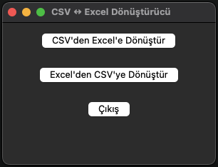

# CSV to Excel Converter

Bu araç, CSV dosyalarını kolayca Excel dosyalarına dönüştürmenizi sağlar.

CSV dosyaları, veri depolama ve değişiminde yaygın olarak kullanılır. Özellikle aşağıdaki alanlarda sıkça tercih edilir:

- Veri analizi ve raporlama
- Veri yedekleme ve arşivleme
- Web uygulamalarında veri aktarımı
- Finansal ve muhasebe verilerinin yönetimi
- Bilimsel araştırmalar ve deneysel verilerin kaydedilmesi
- E-ticaret ve envanter yönetimi

Bu araç sayesinde, bu tür verileri Excel formatına dönüştürerek daha kolay analiz edebilir ve raporlayabilirsiniz.

## Özellikler

- CSV dosyalarını Excel formatına dönüştürme
- Excel dosyalarını CSV formatına dönüştürme

## Gereksinimler

- Python 3.x
- pandas kütüphanesi
- openpyxl kütüphanesi

## Kurulum

1. Bu projeyi klonlayın veya indirin:

   ```sh
   git clone https://github.com/phokai/csv_to_excell.git
   cd csv_to_excel_converter
   ```

2. Gerekli kütüphaneleri yükleyin:

   ```sh
   pip install pandas openpyxl

   ```

3. Uygulamayı derleyin:
   - macOS için:
     ```sh
     pyinstaller --windowed --name="CSV_Excel_Donusturucu" --noconsole --icon=img/app_icon.icns "csv_to_excell.py"
     ```
   - Windows için:
     ```sh
     pyinstaller --windowed --name="CSV_Excel_Donusturucu" --noconsole --icon=img/app_icon.ico "csv_to_excell.py"
     ```
   - Linux için:
     ```sh
     pyinstaller --windowed --name="CSV_Excel_Donusturucu" --noconsole --icon=img/app_icon.ico "csv_to_excell.py"
     ```

## Kullanım

CSV veya HTML dosyalarını basit grafik arayüz ile Excel dosyasına dönüştürebilirsiniz.



1. "CSV Dosyasını Seçin" veya "HTML Dosyasını Seçin" butonuna tıklayın ve dosyayı seçin.
2. Dönüştürme işlemi otomatik olarak başlayacaktır.
3. Dönüştürme işlemi tamamlandığında, "Dönüştürme Tamamlandı" mesajı görüntülenecektir.
